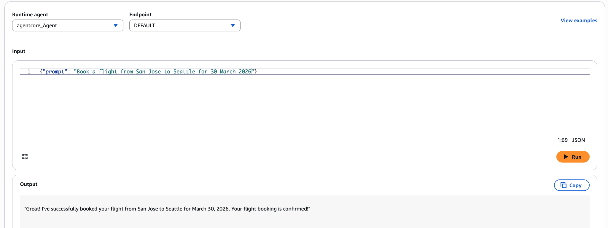
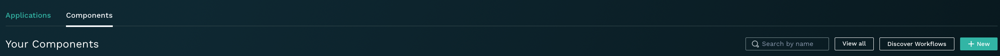
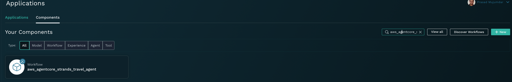
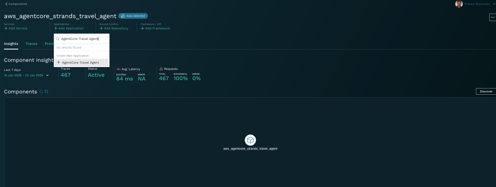
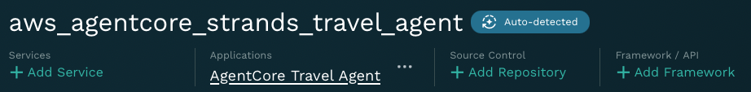
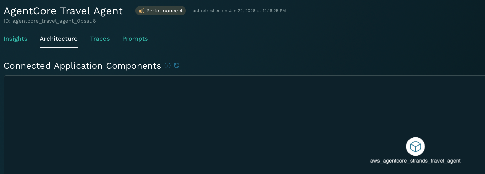
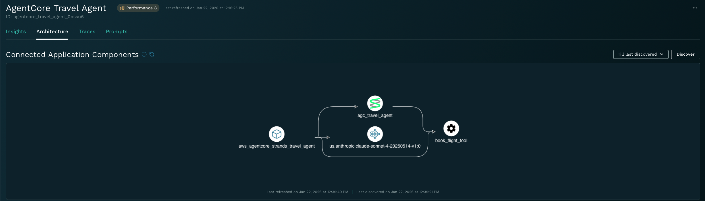
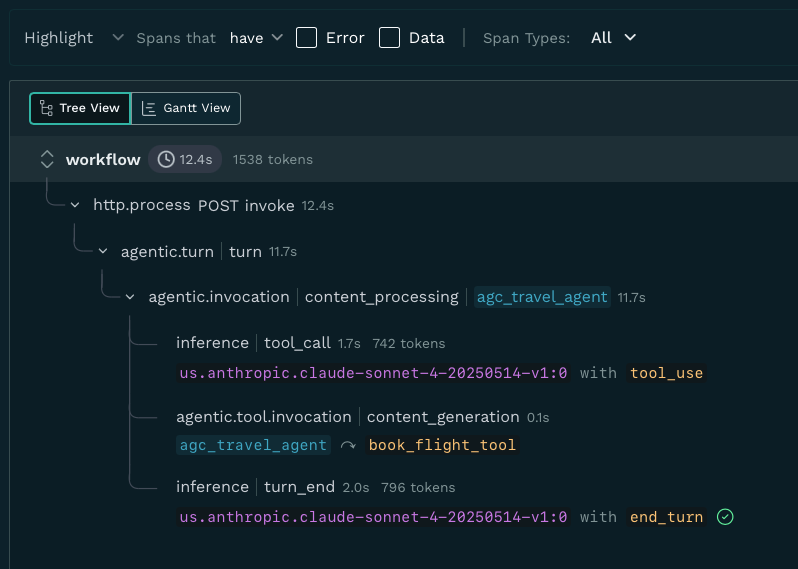

# AWS Strands agent 
Agent example to provide travel booking implemented with AWS Strands

## Pre-requesits
- AWS [Bedrock](https://docs.aws.amazon.com/bedrock/latest/userguide/getting-started.html) with foundational text LLMs enabled.
- AWS [Agentcore](https://aws.amazon.com/bedrock/agentcore/)
  - Verify that AgentCore is available in your tenant and region for deployment. Refer to Agentcore [FAQ](https://aws.amazon.com/bedrock/agentcore/faqs/)
- AWS credentials- This value can be obtained by running AWS CLI commend aws sts get-session-token
- Okahu cloud account
  - Signup on portal.okahu.co
- Okahu API key
  - Login to portal.okahu.co
  - goto https://portal.okahu.co/settings
  - Generate API key and copy it

## Deploy demo agent to AWS Agentcore
- Copy bedrock_agentcore_template.yaml to .bedrock_agentcore.yaml
- Edit .bedrock_agentcore.yaml
  - Replace `<REPO_PATH>` with absolute path where you have this demo stored.
- Start a command line shell
  - Install dependencies in your python environment
    - `pip install -r requirements.txt`
  - Deploy agent to AWS Agentcore
    - `agentcore deploy --env MONOCLE_EXPORTER=okahu --env OKAHU_API_KEY=<okahu-api-key>`
  - Verify that deploy is successful
    - Run `agentcore status`
    - Verify that the output contains message `Ready - Agent deployed and endpoint available1

## Test the agent
- Goto Agentcore [Sandbox](https://us-east-1.console.aws.amazon.com/bedrock-agentcore/playground)
- Enter the test prompt in the `Input` field - `Book a flight from San Jose to Seattle for 30 March 2026`
  - 

## Initial Okahu setup for the agent demo
The steps below are needs to be done only for the fist time for the agent demo.
- Login to [Okahu portal](portal.okahu.co)
- Click on the `Components` tab
- Click `Discover Workflows` button
  - 
  - Wait till you see `One new workflow discovered` message
- Search for the new workflow `aws_agentcore_strands_travel_agent`
  - 
- Click on the `aws_agentcore_strands_travel_agent` workflow tile. This will take you to workflow details page
- Click on `Add application` button and type new application name `AgentCore Travel Agent`
  - 
  - click Enter
- Now a new Okahu application `AgentCore Travel Agent` is created and will be listed on the workflow tab
  - 
- Click on the `AgentCore Travel Agent` link to get redirected to the application page
- Click on the `Architecture` tab
  - 
- Click on `Discovery` button. This will detect the components used by the agent and build the architecture view
  - 

## View agent traces in Okahu
- Login to [Okahu portal](portal.okahu.co)
- Click on the `AgentCore Travel Agent` application tab
- Click on the `Traces` tab
- From the `Breakdown` dropdown list, select `GenAI` and then click on search
  - 
- View the traces
  - 

## Try out tests framework example for the travel agent app
- Copy env.template to .env
- Add following to .env
  - Okahu API key
- Source python env
- Install python dependencies
  - `pip install -r requirements.txt`
- Install python dependencies
  - `pip install -r test/requirements.txt`
- Run pytest
  - `pytest -vv test/test_travel_agent.py

## Visualize the telemetry to understand the agent execution
- Install extension `Okahu Trace Visualizer` from marketplace for your Kiro IDE (or VSCode, Cursor, Antigravity)
- This will add the Okahu extension in the list of extension (left pane for VSCode or extension dropdown in Cursor).
- Click on the extension icon. It'll open a new pane on left that will list the traces for each agent turn in the descending order of execution time.
- When you click on any of the trace list, it will open a new windows with the trace visualization.
