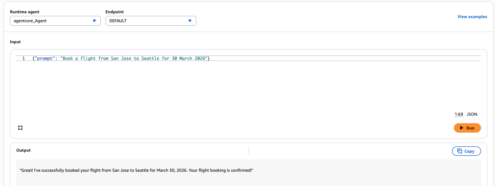
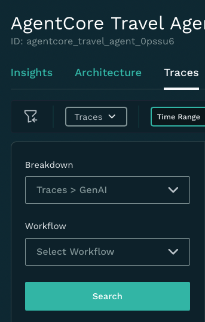
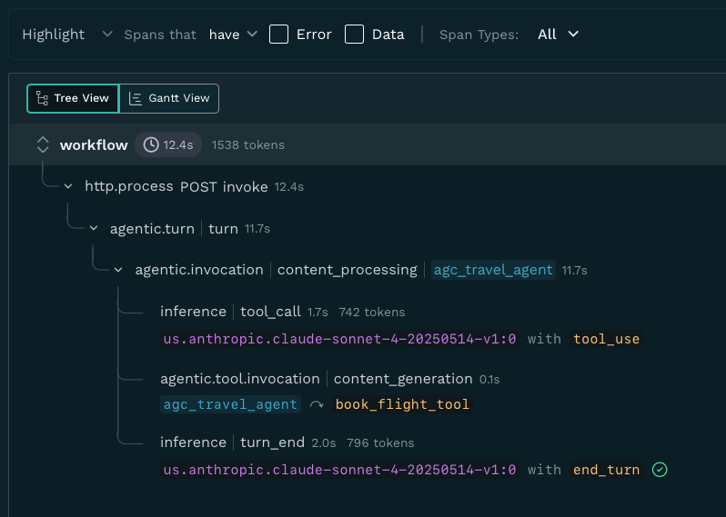

# AWS Strands agent in AWS Agentcore
This demo includes a mock travel agent that accepts flight and travel booking requests. The agent code is implemented using AWS Strands agentic framework. The demo scripts helps you to deploy this agent in AWS Agentcore service. The agent is enabled to generate [Monocle](monocle2ai.org) traces and send those to [Okahu cloud](www.okahu.ai).

## Prerequisites
- AWS [Bedrock](https://docs.aws.amazon.com/bedrock/latest/userguide/getting-started.html) with foundational text LLMs enabled.
- AWS [Agentcore](https://aws.amazon.com/bedrock/agentcore/)
  - Verify that AgentCore is available in your tenant and region for deployment. Refer to Agentcore [FAQ](https://aws.amazon.com/bedrock/agentcore/faqs/)
- AWS CLI
  - Install AWS CLI by following the [installation instructions](https://docs.aws.amazon.com/cli/latest/userguide/getting-started-install.html)
- AWS credentials
  - Obtain credentials by running AWS CLI `aws sts get-session-token` in the Terminal. For more options please refer to AWS [instructions](https://docs.aws.amazon.com/cli/v1/userguide/cli-chap-authentication.html) on CLI auth.
  - Use the two values from the output:
    ```json
    "Credentials": {
        "AccessKeyId": "<VALUE>",
        "SecretAccessKey": "<VALUE>"
    }
    ```
  - Note: You can use these exact names (`AccessKeyId` and `SecretAccessKey`) in your `.env` file, or map them to standard AWS environment variable names (`AWS_ACCESS_KEY_ID` and `AWS_SECRET_ACCESS_KEY`)

- Okahu cloud account
  - Sign up on [Okahu portal](https://portal.okahu.co)
- Okahu API key
  - Go to [Okahu settings](https://portal.okahu.co/settings)
  - Generate API key and copy it

## Setup demo environment

### 1. Create and activate virtual environment
- Start a command line shell
  - Create a Python virtual environment
    - `python -m venv .venv`
  - Activate the virtual environment
    - On macOS/Linux: `source .venv/bin/activate`
    - On Windows (Git Bash): `source .venv/bin/activate`
    - On Windows (Command Prompt): `.venv\Scripts\activate.bat`
    - On Windows (PowerShell): `.venv\Scripts\Activate.ps1`
- Install dependencies in your python environment
  - `pip install -r requirements.txt`

### 2. Configure environment variables
- Copy the environment template:
  - On macOS/Linux: `cp env_template .env`
  - On Windows: `copy env_template .env`
- Edit `.env` and set the following values:

#### Required for testing
  - `OKAHU_API_KEY`: Your Okahu API key from portal settings
  - `AWS_ACCESS_KEY_ID`: Your AWS access key ID
  - `AWS_SECRET_ACCESS_KEY`: Your AWS secret access key
  - `AWS_REGION`: Your AWS region (e.g., `us-east-1`)

#### Alternative AWS credential names
  - **Option**: Instead of `AWS_ACCESS_KEY_ID` and `AWS_SECRET_ACCESS_KEY` above, you can use:
    - `AccessKeyId`: Copy directly from `aws sts get-session-token` output
    - `SecretAccessKey`: Copy directly from `aws sts get-session-token` output
  - Note: Use either the `AWS_*` variables OR these alternative names, not both

#### Recommended for trace export
  - `MONOCLE_EXPORTER`: Set to `okahu,file` to export traces to Okahu and local files
  - `MONOCLE_TEST_WORKFLOW_NAME`: Set to `test_aws_agentcore_strands_travel_agent` to identify your test workflow

#### For AgentCore deployment
  - `AGENTCORE_RUNTIME_URL`: AgentCore runtime URL (typically set automatically during deployment)

### 3. Deploy to AWS Agentcore
- Run Okahu demo setup tool. This will deploy demo agent to AWS Agentcore and setup Okahu tenant for consuming traces from that deployment
  - ```okahu_agentcore_demo_setup --key <OKAHU-API-KEY>```
  - Verify that you see `Demo setup completed successfully` at the end

## Test the agent

### Test in Agentcore Sandbox in cloud
- Goto Agentcore [Sandbox](https://us-east-1.console.aws.amazon.com/bedrock-agentcore/playground)
- Enter the test prompt in the `Input` field - `Book a flight from San Jose to Seattle for 30 March 2026`
  - 
### Test locally using Agentcore CLI tool
- Start command shell and source python env
- Run Agentcore CLI command
  - `agentcore invoke '{"prompt": "<prompt>"}'`

## View agent traces in Okahu
- Log in to [Okahu portal](https://portal.okahu.co)
- Click on the `AgentCore Travel Agent` application tab
- Click on the `Traces` tab
- From the `Breakdown` dropdown list, select `GenAI` and then click Search
  - 
- View the traces
  - 

## Try out tests framework example for the travel agent app
- Start a command line shell
  - Create a Python virtual environment
    - `python -m venv .venv`
  - Activate the virtual environment
    - On macOS/Linux: `source .venv/bin/activate`
    - On Windows (Git Bash): `source .venv/bin/activate`
    - On Windows (Command Prompt): `.venv\Scripts\activate.bat`
    - On Windows (PowerShell): `.venv\Scripts\Activate.ps1`
- Prerequisites for testing
    - Ensure your `.env` file contains:
    - **Required**: `AWS_ACCESS_KEY_ID` (or `AccessKeyId`), `AWS_SECRET_ACCESS_KEY` (or `SecretAccessKey`), `OKAHU_API_KEY`
    - **Recommended**: `MONOCLE_EXPORTER=okahu,file`, `MONOCLE_TEST_WORKFLOW_NAME=test_aws_agentcore_strands_travel_agent`

- Source python env
- Install python dependencies
  - `pip install -r requirements.txt`
- Run pytest
  - `pytest -vv test/test_travel_agent.py`

## Visualize the telemetry to understand the agent execution
- Install extension `Okahu Trace Visualizer` from marketplace for your Kiro IDE (or VSCode, Cursor, Antigravity)
- This will add the Okahu extension in the list of extension (left pane for VSCode or extension dropdown in Cursor).
- Click on the extension icon. It'll open a new pane on left that will list the traces for each agent turn in the descending order of execution time.
- When you click on any of the trace list, it will open a new window with the trace visualization.
