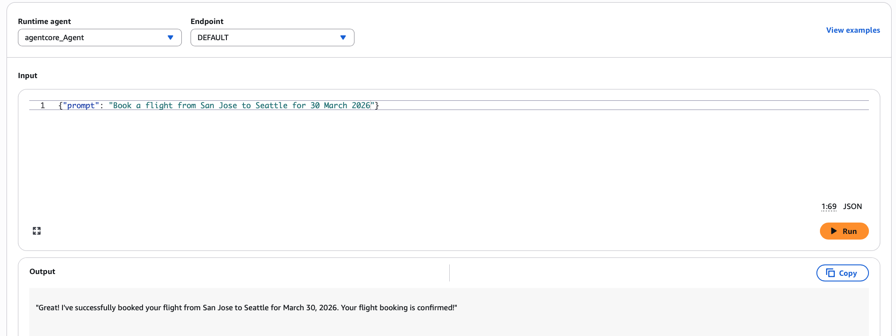
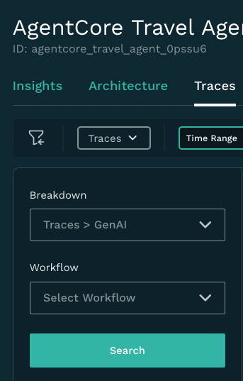
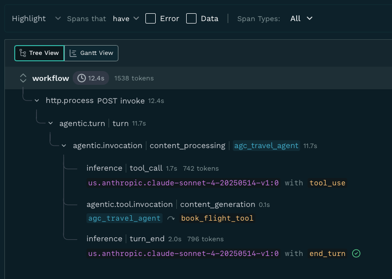

# AWS Strands agent in AWS Agentcore
This demo includes a mock travel agent that accepts flight and travel booking requests. The agent code is implemented using AWS Strands agentic framework. The demo scripts helps you to deploy this agent in AWS Agentcore service. The agent is enabled to generate [Monocle](monocle2ai.org) traces and send those to [Okahu cloud](www.okahu.ai).

## Prerequisites
- AWS [Bedrock](https://docs.aws.amazon.com/bedrock/latest/userguide/getting-started.html) with foundational text LLMs enabled.
- AWS [Agentcore](https://aws.amazon.com/bedrock/agentcore/)
  - Verify that AgentCore is available in your tenant and region for deployment. Refer to Agentcore [FAQ](https://aws.amazon.com/bedrock/agentcore/faqs/)
- AWS CLI
  - Install AWS CLI by following the [installation instructions](https://docs.aws.amazon.com/cli/latest/userguide/getting-started-install.html)
- AWS credentials
  - This value can be obtained by running AWS CLI `aws sts get-session-token` in the Terminal. For more options please refer to AWS [instructions](https://docs.aws.amazon.com/cli/v1/userguide/cli-chap-authentication.html) on CLI auth.
  - Use the two values from the output:
    ```json
    "Credentials": {
        "AccessKeyId": "<VALUE>",
        "SecretAccessKey": "<VALUE>"
    }
    ```

- Okahu cloud account
  - Sign up on [Okahu portal](https://portal.okahu.co)
- Okahu API key
  - Go to https://portal.okahu.co/settings
  - Generate API key and copy it

## Setup demo environment
- Start a command line shell
  - Create a Python virtual environment
    - `python -m venv .venv`
  - Activate the virtual environment
    - On macOS/Linux: `source .venv/bin/activate`
    - On Windows (Git Bash): `source .venv/bin/activate`
    - On Windows (Command Prompt): `.venv\Scripts\activate.bat`
    - On Windows (PowerShell): `.venv\Scripts\Activate.ps1`
- Install dependencies in your python environment
  - `pip install -r requirements.txt`
- Check the region you are deploying to. The setup tool takes it from your AWS configuration, so make sure that region is one where Agentcore is available - `aws configure get region`, or set it for the run with `export AWS_REGION=us-east-1`. Deploying into a region that has never run this demo also creates an execution role, which needs `iam:CreateRole` on top of the `iam:PassRole` the deployment itself requires.
- Run Okahu demo setup tool. This will deploy demo agent to AWS Agentcore and setup Okahu tenant for consuming traces from that deployment.
  - ```okahu_agentcore_demo_setup --key <OKAHU-API-KEY>```
  - Verify that you see `Demo setup completed successfully` at the end

## Test the agent

### Test in Agentcore Sandbox in cloud
- Goto Agentcore [Sandbox](https://us-east-1.console.aws.amazon.com/bedrock-agentcore/playground)
- Enter the test prompt in the `Input` field - `Book a flight from San Jose to Seattle for 30 March 2026`
  - 
### Test locally using Agentcore CLI tool
- Start command shell and source python env
- Run Agentcore CLI command
  - `agentcore invoke '{"prompt": "<prompt>"}'`

## View agent traces in Okahu
- Log in to [Okahu portal](https://portal.okahu.co)
- Click on the `AgentCore Travel Agent` application tab
- Click on the `Traces` tab
- From the `Breakdown` dropdown list, select `GenAI` and then click Search
  - 
- View the traces
  - 

## Try out tests framework example for the travel agent app
This runs the agent locally, in the same process as the test. Three scenarios are covered: booking a flight, booking a hotel, and refusing an off-topic request without calling either tool.
- Start a command line shell
  - Create a Python virtual environment
    - `python -m venv .venv`
  - Activate the virtual environment
    - On macOS/Linux: `source .venv/bin/activate`
    - On Windows (Git Bash): `source .venv/bin/activate`
    - On Windows (Command Prompt): `.venv\Scripts\activate.bat`
    - On Windows (PowerShell): `.venv\Scripts\Activate.ps1`
- Source python env
- Install python dependencies
  - `pip install -r requirements.txt`
- Run pytest
  - `pytest -vv travel_agent/tests/test_travel_agent.py`

## Test the agent running in Agentcore
The test above imports the agent and runs it locally, so its traces are produced on your machine. `travel_agent/tests/test_agentcore_travel_agent.py` tests the *deployed* agent instead: it never imports the agent code, and only sends a prompt to your Agentcore runtime.

The agent's traces are therefore produced inside AWS and exported by the deployed agent's own Monocle instrumentation - they never pass through the test process. Monocle still asserts on them. Every call is made with an Agentcore session id, the deployed agent stamps that id onto each span it emits, and Monocle looks the spans up by it and folds them into the test:

```python
monocle_trace_asserter.run_agent(
    AGENTCORE_RUNTIME_URL, "agentcore",
    "Book a flight from San Jose to Seattle for 22 Nov 2026",
    session_id=session_id,
)

monocle_trace_asserter.called_tool("book_flight_tool").contains_input("San Jose")
monocle_trace_asserter.called_agent("agc_travel_agent").contains_output("Seattle")
```

Those two assertions are the same ones `test_travel_agent.py` makes locally. The only difference is `run_agent`: the agent is named by its Agentcore Runtime ARN rather than by a Python object, and `agentcore` selects the runner that invokes it in AWS.

Five scenarios are covered: the agent's answer, the flight tool with the session scope, the hotel tool, an off-topic refusal, and a two-turn conversation that only the deployment can satisfy - the second turn says "the same day as my flight" and never repeats the date, so booking it at all requires the Agentcore memory store.

The `agentcore` runner and the remote span retrieval it needs come from `monocle-test-tools`, which `requirements.txt` already pins - no extra install step is needed.

### Run the test
- Source your python env and install dependencies as above
- Set `AGENTCORE_RUNTIME_URL` to the Runtime ARN of your deployed agent. `okahu_agentcore_demo_setup` does not write this - it only updates `OKAHU_API_KEY` - so fill it in yourself. `agentcore status` prints the ARN.
- Set `OKAHU_API_KEY` to the key for the tenant **your deployment exports to**, which is not necessarily the one in your `.env`. It is the `OKAHU_API_KEY` environment variable on the runtime itself, readable with:
  - `aws bedrock-agentcore-control get-agent-runtime --agent-runtime-id <AGENT-ID> --region <REGION> --query 'environmentVariables.OKAHU_API_KEY' --output text`
- Make sure your AWS credentials are current - the test calls `InvokeAgentRuntime` on your account, which is the only IAM permission it needs. The region is read from the ARN, so no region variable is needed.
- Run pytest
  - `AGENTCORE_RUNTIME_URL=<ARN> pytest -vv travel_agent/tests/test_agentcore_travel_agent.py`

The tests skip themselves if `AGENTCORE_RUNTIME_URL` is not set, so a checkout without a deployment still runs clean.

Each test takes longer than the local one: the call goes to AWS, and the traces have to reach Okahu before the assertions can see them. Monocle waits for them, so no polling is needed in the test. Expect roughly two minutes for the five tests.

### If the traces are not found
`No traces found for agent_sessions=... in workflow 'aws_agentcore_strands_travel_agent'` means the agent answered but its traces were not visible to the test. Usually one of:
- The `OKAHU_API_KEY` in your `.env` belongs to a different tenant than the one the deployment exports to. The two are the same key when `okahu_agentcore_demo_setup` set both up; they drift apart if either is replaced afterwards. Read the deployment's own key off the runtime as shown above.
- A stale value in your shell is winning over `.env`. `load_dotenv()` does not override variables that are already set, so an `OKAHU_API_KEY`, `OKAHU_API_ENDPOINT` or `OKAHU_INGESTION_ENDPOINT` exported from your shell profile silently takes precedence. `unset` them before running.
- The traces have not landed yet. Raise the wait with `MONOCLE_REMOTE_TRACE_TIMEOUT` (seconds, default 60).
- The deployed agent reports under a different workflow name than `travel_agent.py` sets. Set `AGENTCORE_TRACE_WORKFLOW` to match.

A test that calls no tool - the off-topic one - asserts `called_agent` before its `does_not_call_tool` checks. A run whose spans were never retrieved would satisfy the negative assertions vacuously, so the positive one has to come first.

## Visualize the telemetry to understand the agent execution
- Install extension `Okahu Trace Visualizer` from marketplace for your Kiro IDE (or VSCode, Cursor, Antigravity)
- This will add the Okahu extension in the list of extension (left pane for VSCode or extension dropdown in Cursor).
- Click on the extension icon. It'll open a new pane on left that will list the traces for each agent turn in the descending order of execution time.
- When you click on any of the trace list, it will open a new window with the trace visualization.
